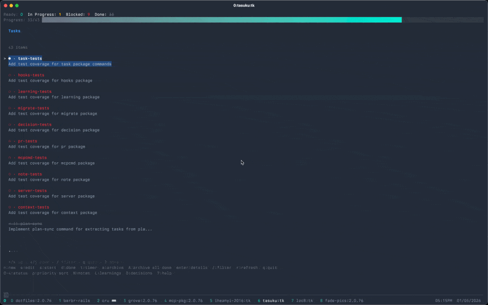

# Tasuku

Agent-first task management for codebases. Designed for AI agents working alongside humans.



## Why Tasuku?

Traditional task management is built for humans pushing updates. Tasuku flips this:

- **Pull over push**: Agents query when needed, no constant context injections
- **Parallel-safe**: Per-file locking for multiple agents working simultaneously
- **Minimal context**: Only load what's needed for the current task
- **Human-readable**: Markdown files with YAML frontmatter (V4), can be edited by hand
- **Git-friendly**: One file per task means clean diffs and fewer merge conflicts
- **Rich content**: Full Markdown support with code blocks, lists, and formatting

## Installation

### From source

```bash
git clone https://github.com/iheanyi/tasuku.git
cd tasuku
go build -o tk ./cmd/tk
sudo mv tk /usr/local/bin/  # or add to your PATH
```

### With go install

```bash
go install github.com/iheanyi/tasuku/cmd/tk@latest
```

## Quick Start

```bash
# Initialize in your project
cd your-project
tk init                     # Creates .tasuku/ directory
git add .tasuku/            # Commit tasks so they travel with your code

# Add some tasks
tk task add "Implement user authentication"
tk task add "Write API documentation" --priority high
tk task add "Set up CI pipeline"

# Add subtasks
tk task add "Create login form" --parent implement-user-authentication

# Start working on a task
tk task start implement-user-authentication

# Mark it done
tk task done implement-user-authentication

# See all tasks
tk task list                  # Table view
tk task list --tree           # Hierarchical subtask view
tk task list --format json    # Output as JSON
```

## CLI Commands

### Task Management

| Command | Description |
|---------|-------------|
| `tk init` | Create `.tasuku/` directory (V4 Markdown format) |
| `tk task list` | List all tasks (use `--status` to filter) |
| `tk task list --tree` | Show hierarchical subtask view |
| `tk task add "description"` | Add a new task |
| `tk task add "desc" --id custom-id` | Add with custom ID |
| `tk task add "desc" --parent parent-id` | Add as subtask |
| `tk task add "desc" --priority high` | Add with priority (critical/high/normal/low/backlog) |
| `tk task show <id>` | Show task details |
| `tk task edit <id> "new description"` | Update task description |
| `tk task start <id>` | Mark task as in progress |
| `tk task start <id> --timer` | Start task with time tracking |
| `tk task pause <id>` | Pause work (auto-stops timer) |
| `tk task done <id>` | Mark task as complete (auto-stops timer) |
| `tk task block <id> --by <other>` | Mark task as blocked |
| `tk task unblock <id>` | Remove all blockers from task |
| `tk task delete <id>` | Delete a task |
| `tk task find <query>` | Search tasks, learnings, and decisions |
| `tk task priority <id> <level>` | Set task priority |
| `tk task ready` | List tasks ready to work on (sorted by priority) |
| `tk task deps <id>` | Show task dependency tree |
| `tk task stats` | Show task statistics and progress |
| `tk validate` | Check task files for errors |
| `tk doctor` | Diagnose Tasuku setup and MCP configuration |
| `tk health` | Project health check with actionable recommendations |
| `tk suggest "task"` | Check if task should persist to Tasuku or stay session-only |
| `tk ui` | Launch the terminal user interface |

### Agent Coordination

| Command | Description |
|---------|-------------|
| `tk task owner <id> <name>` | Assign task to an owner |
| `tk task owner <id> --clear` | Remove owner from task |
| `tk task claim <id> <agent>` | Claim task for exclusive agent work |
| `tk task release <id>` | Release a claimed task |
| `tk task who` | Show tasks claimed by each owner |

### Tags & Custom Fields

| Command | Description |
|---------|-------------|
| `tk task tag add <id> <tag>` | Add a tag to a task |
| `tk task tag remove <id> <tag>` | Remove a tag from a task |
| `tk task list --tag <tag>` | Filter tasks by tag |
| `tk task field set <id> <key> <value>` | Set a custom field |
| `tk task field remove <id> <key>` | Remove a custom field |

### Time Tracking

| Command | Description |
|---------|-------------|
| `tk task timer start <id>` | Start timer on a task |
| `tk task timer stop <id>` | Stop timer and record time |
| `tk task timer status` | Show all running timers |

### Archiving

| Command | Description |
|---------|-------------|
| `tk task archive add <id>` | Archive a completed task |
| `tk task archive list` | List archived tasks |
| `tk task archive restore <id>` | Restore an archived task |

### Context & Knowledge

| Command | Description |
|---------|-------------|
| `tk learn "insight"` | Record a learning |
| `tk learn "insight" --permanent` | Record and append to context file |
| `tk learnings` | List all recorded learnings |
| `tk unlearn <index or text>` | Remove a learning |
| `tk promote <index or text>` | Move learning to permanent documentation |
| `tk promote 1 --to AGENTS.md` | Promote to specific file |
| `tk decide --id <id> --chose X --over Y,Z --because "reason"` | Record a decision |
| `tk note add <task-id> "note"` | Add a note to a task |
| `tk context show` | Output full context as JSON |

### Server & Integration

| Command | Description |
|---------|-------------|
| `tk serve mcp` | Start MCP server (stdio mode for AI tools) |
| `tk serve http` | Start HTTP REST API server on :3000 |
| `tk serve http --port 8080` | Start HTTP server on custom port |
| `tk mcp install` | Install MCP server in Claude Code (global) |
| `tk mcp install --local` | Install MCP to project .claude.json |
| `tk mcp uninstall` | Remove MCP server from Claude Code |
| `tk migrate v3` | Migrate from V2 (.tasuku.json) to V3 (.tasuku/ JSON) |
| `tk migrate v4` | Migrate from V3 to V4 (.tasuku/ Markdown) |
| `tk migrate beads` | Migrate from Beads format |
| `tk migrate beads --dry-run` | Preview migration without changes |
| `tk skills install` | Install Claude Code slash command skills |
| `tk skills uninstall` | Remove Tasuku skills |
| `tk skills list` | List available skills |

### Output Formats

All list commands support the `--format` flag:

```bash
tk list --format table  # Default, human-readable
tk list --format json   # JSON output
tk list --format yaml   # YAML output
```

## Shell Completion

Tasuku supports tab completion for commands, subcommands, flags, and task IDs.

### Quick Setup

```bash
# Bash (Linux)
tk completion bash | sudo tee /etc/bash_completion.d/tk > /dev/null

# Bash (macOS with Homebrew)
tk completion bash > $(brew --prefix)/etc/bash_completion.d/tk

# Zsh
echo 'source <(tk completion zsh)' >> ~/.zshrc

# Fish
tk completion fish > ~/.config/fish/completions/tk.fish
```

### Detailed Setup

#### Bash

```bash
# Generate completion script
tk completion bash > /tmp/tk.bash

# Test in current session
source /tmp/tk.bash

# Install permanently (Linux)
sudo mv /tmp/tk.bash /etc/bash_completion.d/tk

# Install permanently (macOS)
# First install bash-completion: brew install bash-completion@2
tk completion bash > $(brew --prefix)/etc/bash_completion.d/tk
# Add to ~/.bash_profile:
# [[ -r "$(brew --prefix)/etc/profile.d/bash_completion.sh" ]] && source "$(brew --prefix)/etc/profile.d/bash_completion.sh"
```

#### Zsh

```bash
# Option 1: Source directly (add to ~/.zshrc)
source <(tk completion zsh)

# Option 2: Install to fpath
tk completion zsh > "${fpath[1]}/_tk"
# Then reload: autoload -Uz compinit && compinit

# Option 3: Custom directory
mkdir -p ~/.zsh/completions
tk completion zsh > ~/.zsh/completions/_tk
# Add to ~/.zshrc before compinit:
# fpath=(~/.zsh/completions $fpath)
```

#### Fish

```bash
tk completion fish > ~/.config/fish/completions/tk.fish
# Fish auto-loads from this directory
```

### What Gets Completed

After setup, you can tab-complete:

```bash
tk <TAB>                    # Shows: task, learning, decision, note, ...
tk task <TAB>               # Shows: list, add, show, start, done, ...
tk task list --<TAB>        # Shows: --format, --status
tk task start <TAB>         # Shows available task IDs
tk learning <TAB>           # Shows: list, add, remove, promote
```

### Troubleshooting

**Completions not working?**
- Restart your shell after installing
- Zsh: Run `compinit` or restart terminal
- Bash: Ensure bash-completion is installed

**"command not found: compdef" (Zsh)?**
```bash
autoload -Uz compinit && compinit
```

**Outdated completions?**
Regenerate with the same command after upgrading tk.

## HTTP REST API

Start the REST API server:

```bash
tk serve http              # Starts on :3000 by default
tk serve http --port 8080  # Custom port
```

### Endpoints

| Method | Endpoint | Description |
|--------|----------|-------------|
| GET | `/tasks` | List all tasks |
| GET | `/tasks?status=ready` | Filter by status |
| POST | `/tasks` | Create a task |
| GET | `/tasks/{id}` | Get task details |
| PUT | `/tasks/{id}` | Update task status/priority |
| DELETE | `/tasks/{id}` | Delete a task |
| GET | `/ready` | List ready tasks |
| GET | `/context` | Get full context |
| POST | `/learnings` | Add a learning |
| POST | `/decisions` | Record a decision |
| GET | `/schema` | Get JSON schema |
| GET | `/health` | Health check |

### Example API Usage

```bash
# Create a task
curl -X POST http://localhost:3000/tasks \
  -H "Content-Type: application/json" \
  -d '{"description": "Build login form", "priority": 1}'

# Update status
curl -X PUT http://localhost:3000/tasks/build-login-form \
  -H "Content-Type: application/json" \
  -d '{"status": "in_progress"}'

# Add a learning
curl -X POST http://localhost:3000/learnings \
  -H "Content-Type: application/json" \
  -d '{"learning": "JWT tokens expire after 24 hours"}'
```

## Promoting Learnings to Permanent Docs

Tasuku can auto-detect your AI tool context file and promote learnings there:

```bash
# List learnings
tk learnings

# Promote learning #2 to auto-detected context file
tk promote 2

# Promote to a specific file
tk promote 2 --to .cursorrules

# Keep in .tasuku.json after promoting
tk promote 2 --keep
```

**Auto-detected context files** (in priority order):
1. `CLAUDE.md` - Claude Code
2. `.cursorrules` - Cursor
3. `.github/copilot-instructions.md` - GitHub Copilot
4. `AGENTS.md` - Generic AI agents

If none exist, defaults to creating `CLAUDE.md`.

## Claude Code Integration

Tasuku includes an MCP (Model Context Protocol) server for seamless Claude Code integration.

### Install the MCP server

```bash
tk mcp install
```

This adds Tasuku to your Claude Code settings. Restart Claude Code to activate.

### Available MCP Tools

Once installed, Claude has access to these tools:

**Task Operations:**
- `tk_list`, `tk_add`, `tk_show`, `tk_edit`, `tk_delete` - CRUD operations
- `tk_start`, `tk_pause`, `tk_done` - Status transitions
- `tk_block`, `tk_unblock` - Dependency management
- `tk_priority` - Set task priority
- `tk_find` - Search across tasks, notes, learnings
- `tk_ready` - List tasks ready to work on
- `tk_deps` - Show task dependency tree
- `tk_stats` - Project statistics and progress
- `tk_health` - Project health check with recommendations

**Agent Coordination:**
- `tk_claim`, `tk_release`, `tk_owner` - Task ownership for multi-agent work
- `tk_who` - Show tasks claimed by each owner

**Tags & Fields:**
- `tk_tag_add`, `tk_tag_remove` - Manage task tags
- `tk_field_set`, `tk_field_remove` - Custom metadata

**Time Tracking:**
- `tk_timer_start`, `tk_timer_stop`, `tk_timer_status` - Track time spent

**Context:**
- `tk_context` - Get full project context
- `tk_learn`, `tk_decide`, `tk_note` - Record knowledge
- `tk_suggest` - Check if task should persist to Tasuku

**Learnings:**
- `tk_learning_list` - List all learnings
- `tk_learning_promote` - Promote learning to permanent docs
- `tk_learning_remove` - Remove a learning
- `tk_learning_rules` - Find "never/always" patterns

**Decisions:**
- `tk_decision_list` - List all decisions
- `tk_decision_remove` - Remove a decision

**Notes:**
- `tk_note_list` - List notes for a task
- `tk_note_remove` - Remove a note

**Archiving:**
- `tk_archive`, `tk_archive_list`, `tk_archive_restore` - Archive management
- `tk_archive_all` - Archive all done tasks older than a duration

### Slash Command Skills

Install slash command skills for quick access to common operations:

```bash
tk skills install           # Install to current project (.claude/skills/)
tk skills install --global  # Install globally (~/.claude/skills/)
```

This installs skills that can be invoked with `/skill-name`:

| Skill | Description |
|-------|-------------|
| `/tasuku` | Overview and quick reference |
| `/tasuku-add` | Create a new task |
| `/tasuku-list` | List all tasks with optional filtering |
| `/tasuku-ready` | Show tasks ready to work on |
| `/tasuku-start` | Start working on a task |
| `/tasuku-done` | Mark a task complete |
| `/tasuku-block` | Mark task as blocked |
| `/tasuku-show` | Show task details |
| `/tasuku-learn` | Record learnings and insights |
| `/tasuku-decide` | Record architectural decisions |
| `/tasuku-note` | Add notes to tasks |
| `/tasuku-promote` | Promote learnings to docs |
| `/tasuku-context` | Get full project context |
| `/tasuku-stats` | Show task statistics |

Restart Claude Code after installing for skills to take effect.

### Manual Configuration

If you prefer manual setup, add this to `~/.claude.json`:

```json
{
  "mcpServers": {
    "tasuku": {
      "command": "/path/to/tk",
      "args": ["serve", "mcp"]
    }
  }
}
```

## Terminal UI

Launch an interactive terminal dashboard:

```bash
tk ui
```

### Keybindings

| Key | Action |
|-----|--------|
| `j/k`, arrows | Navigate tasks |
| `enter` | View task details |
| `n` | Create new task |
| `e` | Edit task description |
| `s` | Start task |
| `d` | Mark done |
| `P` | Pause task |
| `x` | Delete task |
| `b` | Block task |
| `u` | Unblock task |
| `t` | Toggle timer |
| `a` | Archive done task |
| `A` | Archive all done tasks |
| `/` | Filter/search tasks |
| `0-4` | Filter by status |
| `p` | Sort by priority |
| `r` | Refresh |
| `N` | View notes |
| `L` | View learnings |
| `D` | View decisions |
| `?` | Help |
| `q` | Quit |

## Hooks

Tasuku provides hooks for automating task management workflows with git and Claude Code.

### Installation

```bash
# Install all hooks (git local + Claude global)
tk hooks install

# Install Claude hooks to project instead of global
tk hooks install --local

# Install only git hooks
tk hooks install --git

# Install only Claude Code hooks (global)
tk hooks install --claude

# Install Claude hooks to project .claude/
tk hooks install --claude --local

# Overwrite existing hooks
tk hooks install --force
```

### Git Hooks

Git hooks are always installed locally to `.git/hooks/`:

- **pre-commit**: Validates task files before committing
- **post-commit**: Auto-updates task status based on commit messages

### Claude Code Hooks

Claude hooks can be global (`~/.claude/settings.json`) or local (`./.claude/settings.json`):

| Hook | Event | Description |
|------|-------|-------------|
| **SessionStart** | Session begins | Shows project context summary and suggested next task |
| **Stop** | Claude stops | Reminds about running timers, in-progress tasks, and prompts for reflection |
| **PreCompact** | Before context compaction | Critical checkpoint to capture decisions/learnings before context loss |
| **PostToolUse/ExitPlanMode** | After plan mode exits | Prompts to sync plan tasks to Tasuku |
| **PostToolUse/TodoWrite** | After TodoWrite used | Suggests persisting project-level todos to Tasuku |
| **SubagentStop** | After subagent completes | Prompts for insights after exploration work |
| **UserPromptSubmit** | User sends message | Detects task-related intent and shows context |

Use `--local` to install to project `.claude/` for project-specific configuration.

### Automatic Nudges

Tasuku's hooks automatically prompt for knowledge capture at key moments:

1. **Session Start**: Shows context summary and active tasks
2. **During Work**: TodoWrite hook suggests persisting important todos
3. **After Exploration**: SubagentStop prompts for learnings from deep dives
4. **Task Completion**: MCP tool responses include reflection hints
5. **Before Context Loss**: PreCompact urgently prompts for decisions/learnings
6. **Session End**: Stop hook reminds about timers and prompts reflection

This ensures decisions and learnings are captured without manual prompting.

### Additional Commands

```bash
# Display session context summary
tk hooks session

# Check for end-of-session reminders
tk hooks stop-reminder

# Pre-compaction checkpoint (capture before context loss)
tk hooks pre-compact

# Analyze TodoWrite output for project-level tasks
tk hooks todo-check

# Extract tasks from a plan file
tk hooks plan-sync

# Remove all hooks
tk hooks uninstall

# Remove only Claude hooks (global)
tk hooks uninstall --claude

# Remove project-level Claude hooks
tk hooks uninstall --claude --local
```

## Data Format

### V4 Format (Default)

Tasuku stores tasks as Markdown files with YAML frontmatter in the `.tasuku/` directory:

```
.tasuku/
├── tasks/
│   └── task-id.md          # Markdown file per task
├── archive/
│   └── old-task.md         # Archived tasks
├── context/
│   ├── learnings.md        # Learnings in Markdown
│   └── decisions.md        # Decisions in Markdown
├── config.json             # Version marker (version: 4)
└── index.json              # Auto-generated index for fast queries
```

**Task file** (`.tasuku/tasks/task-id.md`):
```markdown
---
status: ready
priority: 2
tags: [backend, api]
blocked_by: []
created_at: 2024-01-04T10:00:00Z
updated_at: 2024-01-04T10:00:00Z
---

# Implement user authentication

Add JWT-based authentication to protect API endpoints.

Support **rich formatting**, `inline code`, and code blocks:

```go
func ValidateToken(token string) (*Claims, error) {
    // Implementation
}
```

## Notes

### 2024-01-04 11:00 [abc123]
Started investigating authentication middleware options.
```

### V3 Format (Legacy JSON)

Directory-based JSON format. Use `tk migrate v4` to upgrade.

```
.tasuku/
├── tasks/
│   └── task-id.json        # JSON file per task
├── archive/
│   └── old-task.json       # Completed/archived tasks
└── context/
    ├── learnings.json      # Array of learnings
    └── decisions.json      # Array of decisions
```

### V2 Format (Legacy)

Single `.tasuku.json` file with all data. Auto-detected for backwards compatibility.
Use `tk migrate v3` then `tk migrate v4` to upgrade.

### Task Statuses

- `ready` - Can be started
- `in_progress` - Currently being worked on
- `blocked` - Waiting on other tasks
- `done` - Completed

### Priority Levels

| Level | Name | Description |
|-------|------|-------------|
| 0 | Critical | Urgent, blocking issues |
| 1 | High | Important, do soon |
| 2 | Normal | Default priority |
| 3 | Low | Can wait |
| 4 | Backlog | Future work |

## Parallel Agent Safety

Tasuku uses `flock` for file locking, making it safe for multiple agents to work simultaneously:

```bash
# Agent 1                    # Agent 2
tk task start auth-task      tk task start api-task
# Both acquire locks safely, no corruption
```

V3's per-file locking means agents working on different tasks never block each other.

## Migration

### From V3 to V4

If you have an existing V3 `.tasuku/` directory with JSON files:

```bash
# Preview the migration
tk migrate v4 --dry-run

# Run the migration (creates backup in .tasuku.v3.bak/)
tk migrate v4
```

### From V2 to V3

If you have an existing `.tasuku.json`:

```bash
# Preview the migration
tk migrate v3 --dry-run

# Run the migration
tk migrate v3

# Then migrate to V4
tk migrate v4
```

### From Beads

If you have an existing `.beads/` directory:

```bash
# Preview the migration
tk migrate beads --dry-run

# Run the migration
tk migrate beads
```

This converts your Beads issues to Tasuku tasks, preserving:
- Task status mapping (open->ready, in_progress->in_progress, closed->done, blocked->blocked)
- Priority levels
- Dependencies (blocked_by relationships)
- Close reasons as notes

## Development

```bash
# Run tests
go test ./...

# Run with race detector
go test -race ./...

# Build
go build -o tk ./cmd/tk
```

## License

MIT
